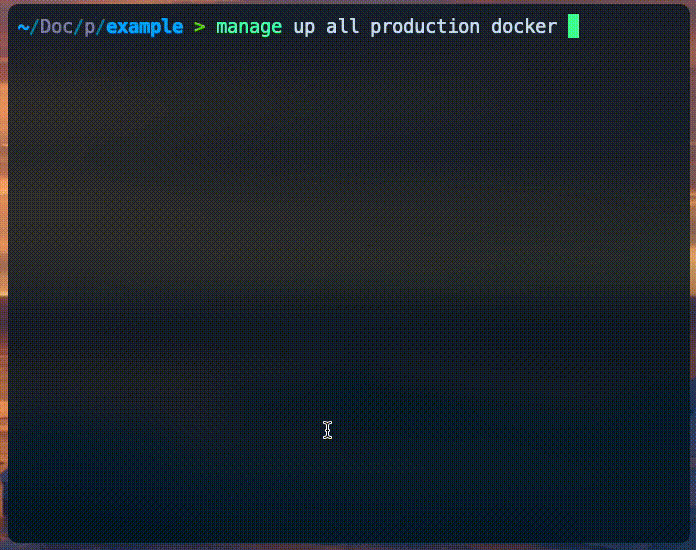

# manage



Manage is a command-line tool for simplifying Docker and Podman container management across multiple environments and services.

It allows you to switch between different environments effortlessly. It supports loading environment variables from plain or encrypted files and integrates them into Docker or Podman compose configurations.

## Installation

1. Download the script:
   ```bash
   curl -o /usr/local/bin/manage https://raw.githubusercontent.com/ArthoPacini/manage/main/manage.py
   ```
2. Make the script executable:
   ```bash
   chmod +x /usr/local/bin/manage
   ```
   
## Usage

```bash
manage [action] [service] [environment] [tool] [--project-name]
```

- **action**: The container action (up, down, restart, build, pause).
- **service**: Specify a single service or 'all' to target all services.
- **environment**: The environment to use, defaults to 'development'.
- **tool**: Specify 'docker' or 'podman' for container management.
- **project-name**: Custom project name, defaults to the directory name followed by '_{environment}'.

You will need at least one `docker-compose.yaml` file and at least one environment file at `./.env/` folder.

### Examples

- Start all containers using the development environment with Podman:
  ```bash
  manage up all development podman
  ```

- Start all containers using the production environment with Docker:
  ```bash
  manage up all production docker
  ```

## Folder Structure

- `docker-compose.yaml`: Default Docker Compose file.
- `.env/`: Directory containing all environment files.

## Example Usage

Let's assume you have three environment files in your `.env/` directory:

- `.env.testing`
- `.env.production.gpg` (encrypted)
- `.env.development`

These files contain the necessary configurations for each of your environments.

### Docker Compose with Placeholders

Create a `docker-compose.yaml` file that uses placeholders for environment variables. This allows you to dynamically adjust container configurations based on the active environment:

```yaml
services:
  app:
    image: docker.io/crccheck/hello-world
    environment:
      API_KEY: "${API_KEY}"
      DATABASE_URL: "${DATABASE_URL}"
```

### Running Commands

When you issue a command using `manage`, the tool looks for an environment-specific Docker Compose file (e.g., `docker-compose.testing.yaml`) and falls back to the default `docker-compose.yaml` if none is found.

- **Development Environment**:
  ```bash
  manage up all development podman
  ```
  This command will load the `.env.development` file, replace the placeholders in the `docker-compose.yaml`, and run all services using Podman.

- **Testing Environment**:
  ```bash
  manage up all testing docker
  ```
  This loads the `.env.testing` file, updates the Docker Compose configurations, and launches all services using Docker.

### Handling Encrypted Environment Files

For sensitive environments like production, you might encrypt your environment file to secure its contents:

- **Production Environment**:
  ```bash
  manage up all production docker
  ```
  In this scenario, `manage` detects that `.env.production.gpg` is encrypted. It will attempt to decrypt the file in-memory (prompting for a YubiKey if necessary). Once decrypted, it substitutes the environment variables into the Docker Compose configurations. If a specific Docker Compose file for production (e.g., `docker-compose.production.yaml`) exists, it will be used; otherwise, it will default to the generic `docker-compose.yaml`.

